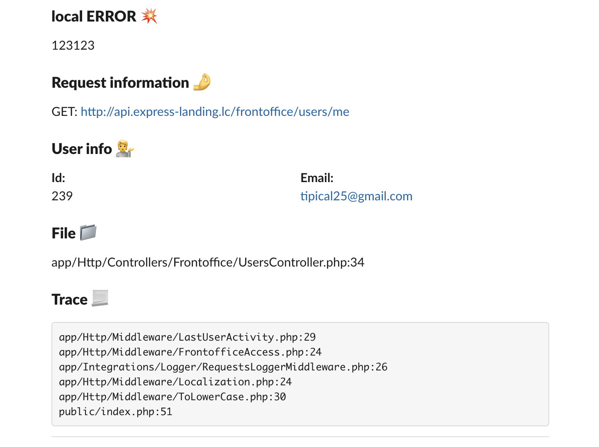
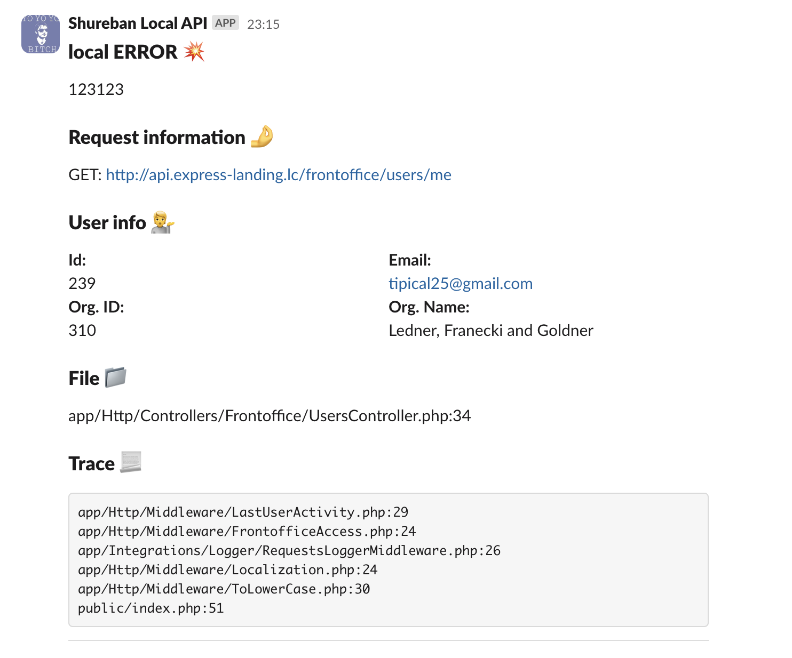

# Laravel logplex

## Installation

Require this package with composer using the following command:

```bash
composer require shureban/laravel-logplex
```

Add the following class to the `providers` array in `config/app.php`:

```php
Shureban\LaravelLogplex\LogplexServiceProvider::class,
```

You have to publish the config file.

```shell
php artisan vendor:publish --provider="Shureban\LaravelLogplex\LogplexServiceProvider"
```

## How to use

### 1. Add new row in `config/logging.php` in section `channels`

```
'logplex' => [
    'driver' => 'custom',
    'via'    => \Shureban\LaravelLogplex\LogplexLogger::class,
    'level'  => env('LOGPLEX_LEVEL', \Monolog\Level::Error),
]
```

### 2. Edit you .env file

```
LOG_STACK_CHANNELS=single,logplex
```

or add additional log channel to `stack` channel. As example:

```
'stack' => [
    'driver'   => 'stack',
    'channels' => ['single','logplex'],
],
```

## Result



## Customization

For example you need to change `UserBlock`. You wanna add information about organization which related with user.

### 1. Create your own version of `MessageBuilder`. Its important to implement from `MessageBuilderInterface`

```php
<?php

namespace App\Logging\Logplex;

use Shureban\LaravelLogplex\Builder\MessageBuilderInterface;
use Shureban\LaravelLogplex\Channels\Slack\Blocks\FileBlock;
use Shureban\LaravelLogplex\Channels\Slack\Blocks\HeaderBlock;
use Shureban\LaravelLogplex\Channels\Slack\Blocks\RequestBlock;
use Shureban\LaravelLogplex\Channels\Slack\Blocks\TraceBlock;
use Shureban\LaravelLogplex\Channels\Slack\Elements\DividerSection;
use Shureban\LaravelLogplex\Channels\Slack\Message;
use Shureban\LaravelLogplex\LogRecord;

class MessageBuilder implements MessageBuilderInterface
{
    public function buildSlackMessage(LogRecord $logRecord, string $username, string $emoji): Message
    {
        $message = new Message($username, $emoji);

        // Other blocks
        $message->addBlock(new UserBlock($logRecord));
        // Other blocks

        return $message;
    }
}
```

### 2. Create your realization of `UserBlock`

```php
<?php

namespace App\Logging\Logplex;

use Shureban\LaravelLogplex\Channels\Slack\Block;
use Shureban\LaravelLogplex\Channels\Slack\Elements\FieldsSection;
use Shureban\LaravelLogplex\Channels\Slack\Elements\HeaderSection;
use Shureban\LaravelLogplex\LogRecord;

class UserBlock implements Block
{
    private LogRecord $logRecord;

    public function __construct(LogRecord $logRecord)
    {
        $this->logRecord = $logRecord;
    }

    public function toArray(): array
    {
        $user = $this->logRecord->getUser();

        if (is_null($user)) {
            return [];
        }

        return [
            (new HeaderSection('User info :information_desk_person:'))->toArray(),
            (new FieldsSection([
                sprintf("*Id:*\n%s", $user->getAuthIdentifier()),
                sprintf("*Email:*\n%s", $user->getEmailForVerification()),
                sprintf("*Org. ID:*\n%s", $user->organization->id),
                sprintf("*Org. Name:*\n%s", $user->organization->name),
            ]))->toArray(),
        ];
    }
}
```

## Result



